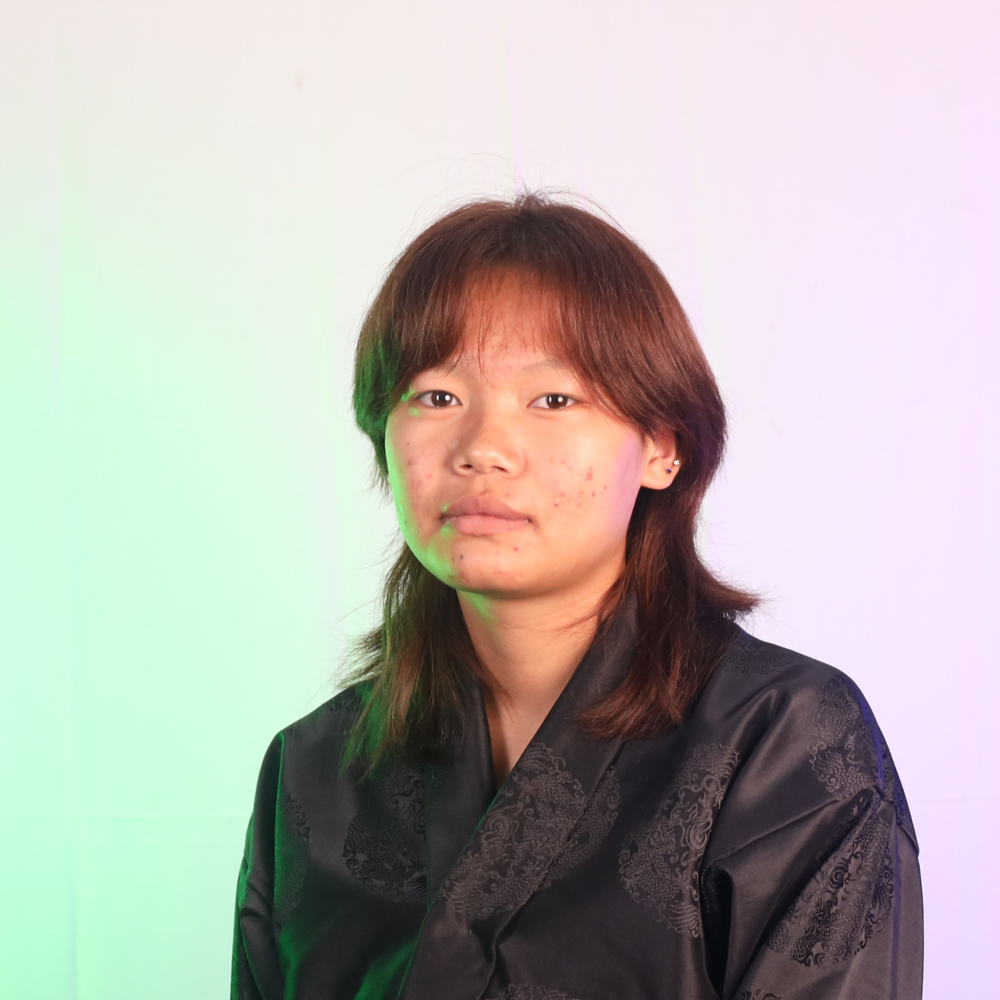

# Personal Profile

Welcome to my personal profile! This document provides an overview of the structure and content of my profile page. The page is designed to showcase my skills, projects, and experiences as a Software Engineering student.

## Table of Contents

- [Home](#home)
- [About Me](#about-me)
- [Services](#services)
- [Portfolio](#portfolio)
- [Contact](#contact)
- [Footer](#footer)

## Home

### I am Sonam Zangmo
I am a Software Engineering Student

---

## About Me

### About Me
Hello There, I am **Sonam Zangmo**

A passionate Software Engineering student with a keen interest in both back-end and front-end development. I love exploring the intersection of design and technology, and I enjoy bringing ideas to life through intuitive and user-friendly interfaces.

Proficient in Figma, I use my design skills to craft engaging digital experiences while continuously learning and evolving my technical expertise. When I'm not coding or designing, you can find me exploring the latest trends in technology and UI/UX.

---

## Services

As a first-year software engineering student with a passion for design, I utilize Figma to create intuitive and visually engaging user interfaces. My focus is on merging technical skills with creative design solutions to build functional and user-centered digital experiences.

### Services Offered

- **Web Design**: Offering web design services for personal profiles, specializing in clean, responsive designs using Figma. Tailored for first-year software engineering students.
  
- **Copyright**: You can protect personal profile designs in Figma by registering copyrights or using licenses through creative services like Creative Commons.
  
- **Graphics Designing**: I offer graphic design services for personal profiles using Figma, tailored for first-year software engineering students seeking a unique visual identity.

---

## Portfolio

My portfolio showcases my journey in design and development. Using Figma, I create intuitive user interfaces and engaging layouts. My projects emphasize problem-solving and creativity, reflecting my commitment to learning and growth in both software engineering and design principles.

### Portfolio Filter
- All
- Web Design
- UI/UX
- Development

### Portfolio Items

---

## Contact

I’m excited to design my personal profile in Figma. I aim to showcase my skills, projects, and experiences creatively and engagingly. I’m eager to learn and explore design principles to make my profile stand out and reflect my passion for technology and innovation.

### Get In Touch
- **Call Me**: +975 17948142
- **Address**: CST, Bhutan
- **Email**: [02240365.cst@rub.edu.bt](mailto:02240365.cst@rub.edu.bt)

---

## Footer

&copy; 2024 Sonam Zangmo. All rights reserved.